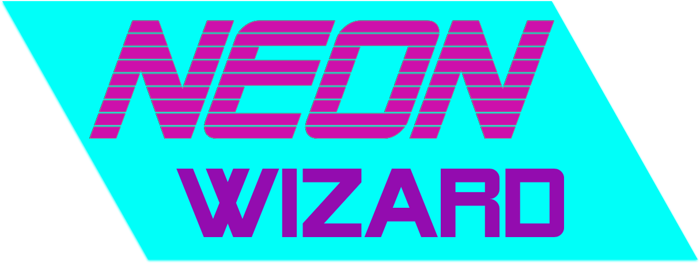

#### Names of Authors
Chris Breaux, Riley Benson

### Description

* This is a refactor of an earlier project. The goal of the original project was to utilize custom animations to create a simple game. 
The code is currently being re-worked to take advantage of webpack, CSS grid, repsonsive web design. The game itself allows players to "shoot"
projecticles at moving targets. The targets will react if they are struck by the projectile.


### Technologies and Resources

* HTML  
* CSS
* JavaScript
* Webpack


### Setup Instructions
* Clone file from https://github.com/cjbreaux/nw-webpack-refactor.git
* Navigate to the cloned folder in the terminal.
* While in the project folder, run the following in the terminal:
 ```html
$ npm i
```
* After the files have downloaded, run the following:
```html
$ npm start
```


### Stretch Goals

* Import custom animations for the targets
* Add scoring system
* Add multiple projectile types
* Difficulty modifiers

### License

MIT license

Copyright (c) 2019 **Chris Breaux**, **Riley Benson**
